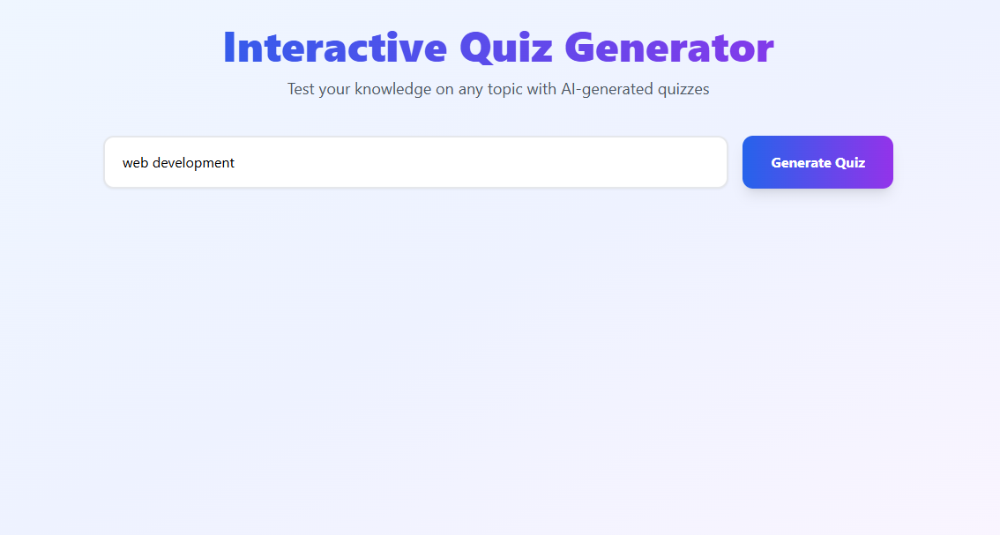
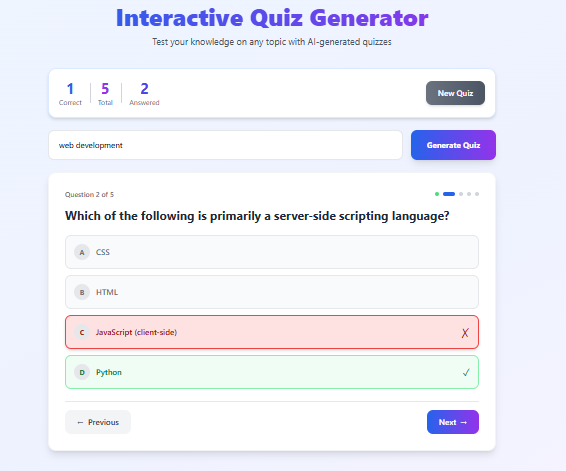
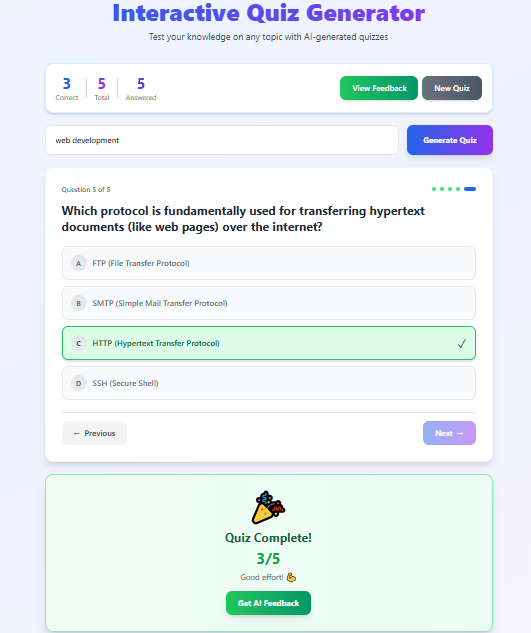
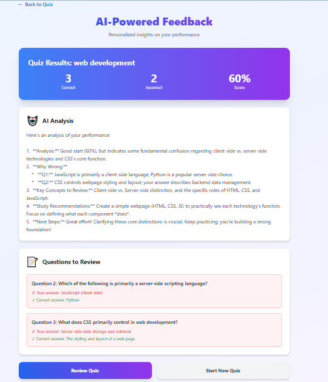

# 🤖 AI Quiz Generator

A full-stack web application that combines **Web Development + AI** to generate topic-based quizzes and give intelligent feedback using **Google Gemini API**.

---

## 🧠 Project Overview

The AI Quiz Generator allows users to:
1. Enter any topic (e.g., JavaScript, History, AI).
2. Automatically generate **5 multiple-choice questions** using AI.
3. Attempt the quiz and submit answers.
4. Receive **AI-based feedback** with explanations and learning tips.

---

## 🏗️ Architecture

### **Frontend**
- Built with **React + TailwindCSS**
- Handles topic input, quiz rendering, answer tracking, and displays feedback.

### **Backend**
- Built using **Node.js (Express)**.
- Integrates **Google Gemini (GenAI)** for question generation and performance feedback.
- Exposes two REST APIs:
  - `/api/generate` → Generates quiz questions.
  - `/api/feedback` → Provides AI-generated feedback.

---

## ⚙️ Backend Setup Instructions

1. Clone the repository.
2. Run the following commands:
   ```bash
   npm install
   npm run dev
   ```
3. Create a `.env` file with the following:
   ```env
   GEMINI_API_KEY=your_google_gemini_api_key
   PORT=5000
   ```
4. Server will run at: [http://localhost:5000](http://localhost:5000)

---

## 🧩 State Management Choices

- **React useState + Context API** for managing:
  - User topic input
  - Quiz question data
  - Answer selections
  - Feedback data
- This avoids heavy external libraries and keeps state lightweight.

---

## 🧰 API Usage Examples

### Generate Questions
```bash
POST /api/generate
Content-Type: application/json

{
  "topic": "Machine Learning"
}
```

**Response:**
```json
[
  {
    "question": "What is supervised learning?",
    "options": ["A", "B", "C", "D"],
    "answer": "A"
  }
]
```

### Generate Feedback
```bash
POST /api/feedback
Content-Type: application/json

{
  "topic": "Machine Learning",
  "totalQuestions": 5,
  "correctCount": 3,
  "incorrectCount": 2,
  "percentage": 60,
  "incorrectQuestions": [
    {
      "question": "What is overfitting?",
      "userAnswer": "B",
      "correctAnswer": "A",
      "allOptions": ["A", "B", "C", "D"]
    }
  ]
}
```

---

## 🧪 Prompts Used

### **Question Generation Prompt**
```
Write 5 multiple choice questions on "<topic>".
Return output strictly in JSON format as:
[
  {"question": "string", "options": ["string","string","string","string"], "answer": "string"}
]
```

### **Feedback Generation Prompt**
```
You are an expert tutor analyzing a student's quiz performance...
Provide point-wise analysis, review concepts, and encouragement.
```

---

## 📸 Screenshots

1. **Home Page (Topic Input)**
2. **Quiz Page (MCQ display)**
3. **Feedback Page (AI-generated analysis)**

</img>
</img>
</img>
</img>

---

## 🐛 Known Issues

- AI may sometimes generate malformed JSON (handled via regex cleanup).
- Feedback text length may slightly vary depending on Gemini response.

---

## 🚀 Future Improvements

- Add user authentication and quiz history.
- Add difficulty levels (Easy / Medium / Hard).
- Integrate speech-to-text quiz input.
- Display answer explanations in real time.

---

